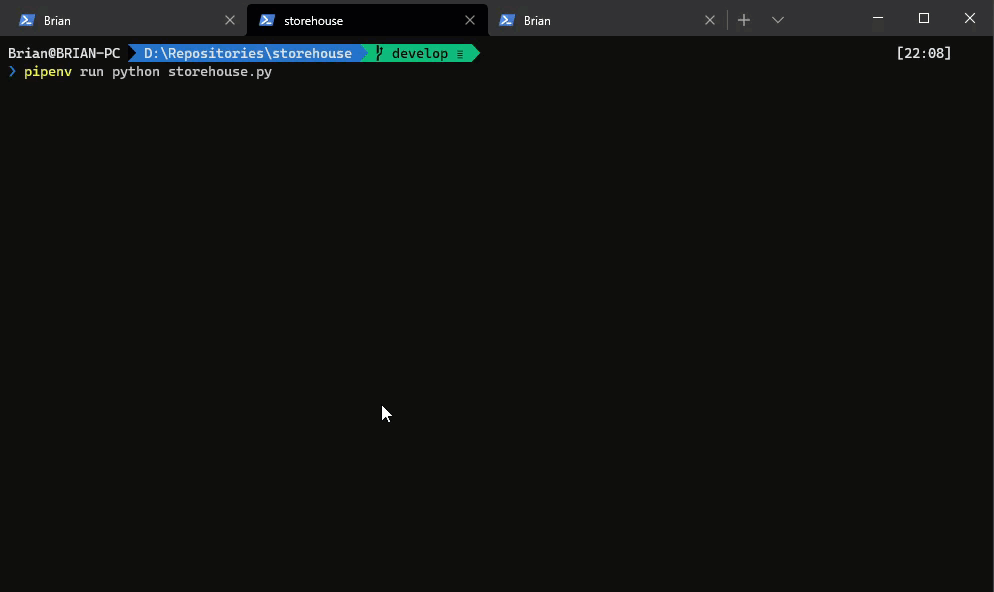

# Storehouse

Storehouse is a centralized threat intelligence list and indicator management tool for importing indicators of compromise into memcached for enrichment in Logstash, as well as APIs for external system interaction

> :warning: **This is a work in progress** :warning:

# Roadmap

- [x] Support for externally hosted lists
- [ ] Support for lists behind API keys
- [ ] Support for custom lists
- [ ] Support for additional list types (e.g. hashes, filenames, custom)
- [ ] Support for memcached over TLS
- [ ] Support for lists behind self-signed or custom certificates
- [ ] UI for managing lists

# Screenshot



# Basic Usage

## Query lists via API

```
curl http://localhost:5000/ip/4.4.4.4
```

## Query lists via Logstash/Memcached
To query against the lists directly from memcached using Elastics Logstash, put the following block in your `filter` block of your Logstash config.

> **Note**: You have to change the namespace and source field depending on the check.  CIDR lookups will not work with this check

```
memcached {
    hosts => ['localhost']
    namespace => "ip"
    get => {
        "%{source_ip}" => "[threat_info]"
    }
}
```

### Supported Namespaces

- ip
- domain
- url

# Setup

## Install

```
git clone https://github.com/n3tsurge/storehouse.git
cd storehouse
pipenv install
pipenv run python storehouse.py
```

## Editing Lists

1. Open lists.json
2. Add/Modify lists in the file
3. Save the file
4. Restart storehouse

### Defining Lists

```
[
    {
        "name": "SpamHaus Drop",
        "url": "https://www.spamhaus.org/drop/drop.txt",
        "format": "cidr",
        "refresh_interval": 60,
        "ttl": 60,
        "disabled": true,
        "type": "list"
    },
    {
        "name": "SpamHaus eDrop",
        "url": "https://www.spamhaus.org/drop/edrop.txt",
        "format": "cidr",
        "refresh_interval": 60,
        "ttl": 60,
        "disabled": true,
        "type": "list"
    },
    {
        "name": "Emerging Threats",
        "url": "http://rules.emergingthreats.net/blockrules/compromised-ips.txt",
        "refresh_interval": 60,
        "ttl": 60,
        "format": "ip",
        "disabled": false,
        "type": "list"
    }
]
```